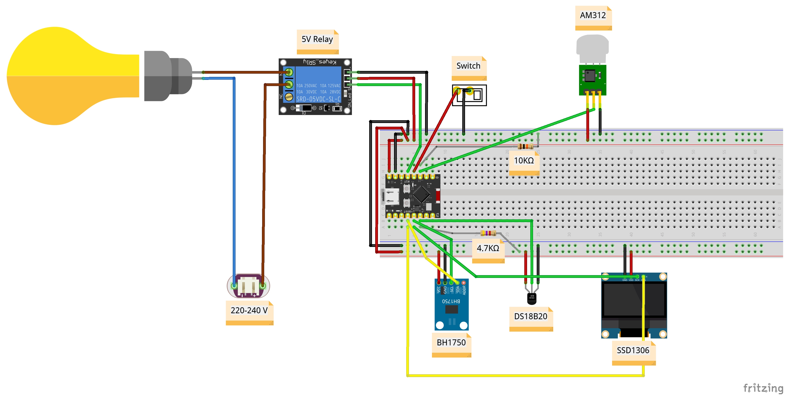

# Demo Light

[![LICENSE][license badge]][license]

A light firmware for the `ESP32-C3` board that controls a light bulb
connected to a 5 V relay. The light can be switched on or off via `HTTP` server
routes, a physical switch, or automatically based on input from a AM312 PIR motion
sensor and a BH1750 ambient light sensor. The board also includes a
DS18B20 temperature sensor, whose readings are displayed on an SSD1306 OLED display.

1. `demo-light`: the main firmware for the ESP32-C3 board, which expects the
   real sensors and relay to be connected.
2. `mock`: a testing binary that simulates sensor input, for development and testing
   without hardware. This firmware uses the built-in LED and the button on GPIO 9 to simulate the light and switch.

It implements an `HTTP` server that manages the state of the light via `REST` requests:

- `light/on` route turns the light on
- `light/off` route turns the light off
- `light/toggle` route toggles the light
- `light/manual` route enables manual mode, allowing control via the physical switch or the `/on` and `/off` routes
- `light/motion-detection` route enables motion-based mode, where the light turns on/off based on the AM312 PIR motion sensor, or via the `/on` and `/off` routes
- `light/ambient-light` route enables ambient-light mode, where the light turns on/off depending on the light level measured by the BH1750 sensor, or via the `/on` and `/off` routes

Each time the light state changes, a JSON message describing the current status
is published to the `/light/<esp32c3_mac_address>/events` topic on an `MQTT` broker.

The board can be discovered by another node on the same network via
an `mDNS-SD` service.

## Wiring

The diagram below illustrates how the components are connected in this demo.



This diagram was created using [`Fritzing`], an open-source tool.
The corresponding project file is [demo.fzz](./wiring/demo.fzz).

## Build

To build the `demo-light` firmware run:

```console
cargo build --release --bin demo-light
```

To build the `mock` firmware run:

```console
cargo build --release --bin mock
```

To build both of them run:

```console
cargo build --release
```

## Run

To flash and run the `demo-light` firmware on an `ESP32-C3` board:

```console
cargo run --release --bin demo-light
```

To flash and run the `mock` firmware on an `ESP32-C3` board:

```console
cargo run --release --bin mock
```

> [!IMPORTANT]
> Always use the release profile [--release] when building esp-hal crate.
  The dev profile can potentially be one or more orders of magnitude
  slower than release profile, and may cause issues with timing-senstive
  peripherals and/or devices.

## Board usage on WSL

Support for connecting `USB` devices is not natively available on [Windows
Subsystem for Linux (WSL)](https://learn.microsoft.com/en-us/windows/wsl/).

In order to use the `ESP32-C3` board with `WSL`, follow this
[guide](https://learn.microsoft.com/en-us/windows/wsl/connect-usb) and manually
connect the `USB` port used by the board to `WSL`.

## Usage Prerequisites

- Rename `cfg.toml.example` to `cfg.toml` and populate it with your
Wi-Fi credentials: `ssid`, `password`, `broker_address`, `broker_port`
- Connect the board to a laptop via a `USB-C` cable to view the logs
- Pin the project to a specific `nightly` version for more stability, if needed

<!-- Links -->
[license]: ./LICENSE
[`Fritzing`]: https://fritzing.org/download/

<!-- Badges -->
[license badge]: https://img.shields.io/badge/license-MIT-blue.svg
